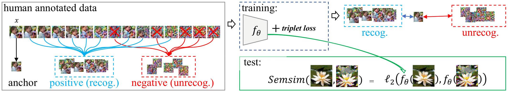

# SemSim

**Privacy Assessment on Reconstructed Images: Are Existing Evaluation Metrics Faithful to Human Perception?**\
Xiaoxiao Sun, Nidham Gazagnadou, Vivek Sharma, Lingjuan Lyu, Hongdong Li, Liang Zheng\
Spotlight at NeurIPS 2023

[[Paper](https://arxiv.org/pdf/2309.13038.pdf)]
[[Project Page](https://sites.google.com/view/semsim)]
[[Talk](https://nips.cc/virtual/2023/poster/71059)]




## Code overview

The important experimental part can be found at ```benchmark/```.

The existing matrics can be found at ```metrics/```.


## Setup
You can use [anaconda](https://www.anaconda.com/distribution/) to install our setup by running
```
conda env create -f semsim.yml
conda activate semsim
```


## Getting Started

### Step 1: train classifier to be evaluatred
```
# using cifar-100 as example
python benchmark/step1_train_classifier.py --data=cifar100 --arch=ResNet20-4 --epochs=200 --aug_list='' --mode=crop
```

### Step 2: attack classifier to get reconstructed images

Orginal images are needed in this step, you can 

* **use the provided [CIFAR-100 samples](https://drive.google.com/file/d/1TjRNUX5KTzEAXYVhCHROD5ZVE5uFNosE/view?usp=drive_link)**

   (1) download the [CIFAR-100 samples](https://drive.google.com/file/d/1TjRNUX5KTzEAXYVhCHROD5ZVE5uFNosE/view?usp=drive_link)
 
   (2) place the original images in the directory: benchmark/images/Cifar_ori/

```
# using cifar-100 as example,

python benchmark/step2_attack.py --data=cifar100 --arch=ResNet20-4 --epochs=200 --aug_list='' --mode=crop --optim='inversed'
```

* **use your own dataset:**

  (1) if you prefer to use your own dataset, place your dataset in your chosen directory.
  
  (2) set the '--rec_data_dir' parameter to the directory containing your dataset.


* **reconstructed images:**

   (1) you can also use our prepared reconstructed images for this step. 
   
   (2) download them from this [link](https://drive.google.com/file/d/1oVPBE0dyCf8eD1-JIu_PeLZ--_bxY6ZN/view?usp=sharing). We also provide some intermediate experimental results, such as prediction socres, top-5.

### Step 3: use different metrics to measure the privacy leakage

* **Exisitng metric**
```
python metrics/pixel_level_metrics

# modify line 137-138 
#    data_dir_raw= '' # dir of orginal images 
#    with open('metrics/folder_names_cifar.txt', 'r') as f: 
#    folder_names_cifar.txt saves dirs of reconstructed images 
```

* **Semsim**

The folder of data and code should look like this:
```
Your project
├── data
│   └──cifar-100-python
│   └──caltech-101
│   └── ...
│   └── human_anno_id
│       └── train_with_ori
└── Semsim_code
```

place the [data](https://drive.google.com/file/d/1M0xnG8mHa2sZHXYrHYWlkeFLZ2XtR0Jm/view?usp=sharing) in the directory: ../data/
```
# train Semsim. 
# Data path is set in the Line 205 of 'inversefed/data/data_processing.py'
python benchmark\Semsim_train_evaluation.py --data human_anno_id --arch ResNet18 --epochs 100 --mode crop --semsim True
```

```
# test Semsim
python benchmark\Semsim_train_evaluation.py --data human_anno_id --targte_data cifar100 --arch ResNet18 --epochs 100 --mode crop --semsim True --evaluate True

# '--targte_data' is the target test set you want to evaluated. The default value is 'cifar100'.
```

## Acknowledgement 
We express gratitudes to the great work [ATSPrivacy](https://github.com/gaow0007/ATSPrivacy), [Inverting Gradients](https://github.com/JonasGeiping/invertinggradients) and [DLG](https://github.com/mit-han-lab/dlg) as we benefit a lot from both their papers and codes.


## Citation 

If you find this repository useful for your research, please consider citing our work:
```bibtex
@inproceedings{sun2023privacy,
  title={Privacy Assessment on Reconstructed Images: Are Existing Evaluation Metrics Faithful to Human Perception?},
  author={Sun, Xiaoxiao and Gazagnadou, Nidham and Sharma, Vivek and Lyu, Lingjuan and Li, Hongdong and Zheng, Liang},
  booktitle={Thirty-seventh Conference on Neural Information Processing Systems},
  year={2023}
}
```
